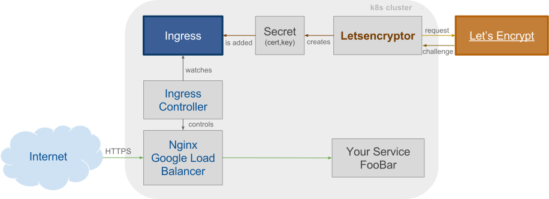

# kubernetes-web-mongo-sample
This is a sample project containing a kubernetes setup of a webservice and mongodb database.

## Setup your kubernetes cluster
You can set up your cluster on Google container engine using the free trial: https://console.cloud.google.com/freetrial

Instructions on how to setup your cluster: https://cloud.google.com/container-engine/docs/before-you-begin

## Inspect your cluster
You can use the Kubernetes dashboard or watch your cluster from the command line: 
- Watch connected cluster: 
    `kubectl config view | grep "current" --watch`
- Watch your pods: 
    `kubectl get pods --namespace=minefield --watch`

## Ingress meets Let's Encrypt

See: http://kubernetes.io/docs/user-guide/ingress/

We are using GCEs with internal load balancer, follow the instruction in this tutorial:
https://cloud.google.com/container-engine/docs/tutorials/http-balancer

Alternatively the nginx ingress controller proposed in: https://github.com/kubernetes/contrib/tree/master/ingress/controllers/nginx can be used.

- Create namespace: 
    `kubectl create -f k8s/minefield.namespace.yaml`
- Create a host/domain, add it to the ingress yaml and create the ingress:
    `kubectl create -f k8s/letsencryptor.ingress.yaml --namespace=minefield`
- Create a tls secret:
    `kubectl create -f k8s/letsencryptor.secret.yaml --namespace=minefield`
    
- Create persistent disks for letsencrpyt:
    `gcloud compute disks create --size 100GB server-letsencryptor-workdir --project=<YOUR_PROJECT> --zone=<ZONE>`

- Create the replication controller for the letsencryptor:
    `kubectl create -f k8s/server-letsencryptor.rc.yaml --namespace=minefield`

## Setup mongodb cluster

- Create persistent disks
 - `gcloud compute disks create --size 200GB mongodb-pd-1 --project=<YOUR_PROJECT> --zone=<ZONE>`
 - `gcloud compute disks create --size 200GB mongodb-pd-2 --project=<YOUR_PROJECT> --zone=<ZONE>`
 - `gcloud compute disks create --size 200GB mongodb-pd-3 --project=<YOUR_PROJECT> --zone=<ZONE>`
- Create replication controllers
 - `kubectl --namespace=minefield create -f mongodb-1.rc.yaml`
 - `kubectl --namespace=minefield create -f mongodb-2.rc.yaml`
 - `kubectl --namespace=minefield create -f mongodb-3.rc.yaml`
- Create services. The service exposes the pod with a stable IP address and DNS name to other pods
 - `kubectl --namespace=minefield create -f mongodb-1.service.yaml`
 - `kubectl --namespace=minefield create -f mongodb-2.service.yaml`
 - `kubectl --namespace=minefield create -f mongodb-3.service.yaml`
- Inititate mongoDB replica set
 - Ensure the mongoDB container is started with --replSet command
 - Find the name of one of the pods
  - `kubectl --namespace=minefield get pods`
 - Get a shell in the pod and initiate the replica set
  - `kubectl --namespace=minefield exec -ti mongodb-1-$$$$$`
  - `mongo`
  - `rs.initiate()`
  - `rs.status()` should report (some fields omitted)
    {
        "set" : "rs-minefield",
        "myState" : 1,
        "term" : NumberLong(1),
        "heartbeatIntervalMillis" : NumberLong(2000),
        "members" : [
                {
                        "_id" : 0,
                        "name" : "mongodb-1-xsltp:27017",
                        "health" : 1,
                        "state" : 1,
                        "stateStr" : "PRIMARY",
                        "configVersion" : 1,
                        "self" : true
                }
        ],
        "ok" : 1
    }
  - Check whether you can reach mongod via its public service name
   - 'mongo mongodb-1:27017' (the port number is *required*)
   - `rs.status()` should give the same output as above
  - Build the cluster to use public service names
   - `c = rs.conf()`
   - `c.members[0].host = "mongodb-1"`
   - `rs.reconfig(c)` (Overwrites our host name)
   - `rs.status()` should still indicate a healthy state using "mongodb-1" as the hostname
   - `rs.add("mongodb-2")`
   - `rs.add("mongodb-3")`
   - Verify the cluster is healthy. `rs.status()` should print (with some fields omitted)
   {
        "set" : "rs-minefield",
        "members" : [
                {
                        "_id" : 0,
                        "name" : "mongodb-1:27017",
                        "health" : 1,
                        "state" : 1,
                        "stateStr" : "PRIMARY",
                        "self" : true
                },
                {
                        "_id" : 1,
                        "name" : "mongodb-2:27017",
                        "health" : 1,
                        "state" : 2,
                        "stateStr" : "SECONDARY",
                        "syncingTo" : "mongodb-1:27017",
                },
                {
                        "_id" : 2,
                        "name" : "mongodb-3:27017",
                        "health" : 1,
                        "state" : 2,
                        "stateStr" : "SECONDARY",
                        "syncingTo" : "mongodb-1:27017",
                }
        ],
        "ok" : 1
    }
    - Connect to another replica set member and check this looks good, too
     - `mongo mongodb-2`
     - `rs.status()` should report same data as above, self being a secondary.
